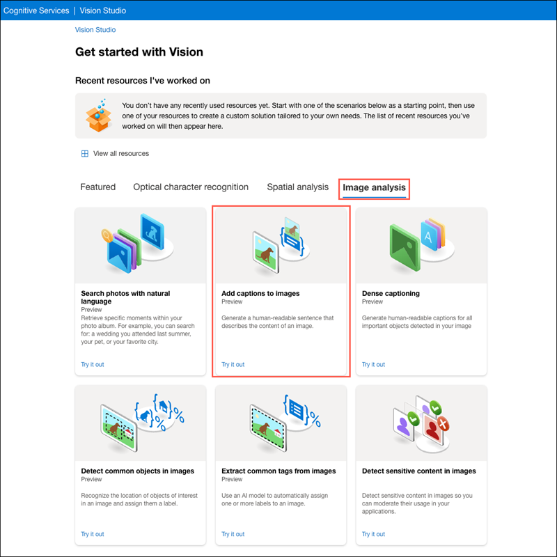

---
lab:
  title: Analisar imagens no Vision Studio
---

# Analisar imagens no Vision Studio 

**A Visão de IA do Azure** inclui vários recursos para entender o conteúdo e o contexto da imagem e extrair informações de imagens. O Vision Studio da IA do Azure permite que você experimente muitos dos recursos de análise de imagem. 

Nesse exercício, você usará o Vision Studio para analisar imagens usando as experiências internas de teste. Por exemplo, suponha que o varejista fictício *Northwind Traders* tenha decidido implementar uma “loja inteligente”, monitorada pelos serviços de IA para identificar os clientes que precisam de assistência e direcionar os funcionários para ajudá-los. Ao usar a Visão de IA do Azure, imagens captadas por câmeras em toda a loja podem ser analisadas para fornecer descrições significativas daquilo que elas retratam.

## Criar um recurso dos *serviços de IA do Azure*

Você pode usar os recursos de análise de imagem da Visão de IA do Azure com um recurso de vários serviços do **serviço de IA do Azure**. Caso ainda não tenha feito isso, crie um recurso dos **serviços de IA do Azure** em sua assinatura do Azure.

1. Em outra guia do navegador, abra o portal do Azure em [https://portal.azure.com](https://portal.azure.com?azure-portal=true), entrando com a conta Microsoft associada à sua assinatura do Azure.

1. Clique no botão **&#65291;Criar um recurso** e pesquise por *serviços de IA do Azure*. Selecione **criar** um plano dos **serviços de IA do Azure**. Você será levado para uma página para criar um recurso dos serviços de IA do Azure. Defina-o com as seguintes configurações:
    - **Assinatura**: *sua assinatura do Azure*.
    - **Grupo de recursos**: *selecione ou crie um grupo de recursos com um nome exclusivo*.
    - **Região**: Leste dos EUA.
    - **Nome**: *insira um nome exclusivo*.
    - **Tipo de preço**: *Sistema operacional Padrão*
    - **Ao marcar essa caixa, confirmo que li e compreendi todos os termos abaixo**: **Selecionado**

1. Selecione **Examinar + criar** e, em seguida, **Criar** e aguarde a conclusão da implantação.

## Conectar seu recurso do Serviço de IA do Azure ao Vision Studio

Em seguida, conecte o recurso do Serviço de IA do Azure que você provisionou acima ao Vision Studio.

1. Em outra guia do navegador, navegue até [Vision Studio](https://portal.vision.cognitive.azure.com?azure-portal=true).

1. Entre com sua conta e verifique se você está usando o mesmo diretório que aquele em que criou o recurso dos Serviços de IA do Azure.

1. Na home page do Vision Studio, selecione **Exibir todos os recursos** no título**Introdução à Visão**.

    

1. Na página **Selecionar um recurso para trabalhar**, passe o cursor do mouse sobre o recurso criado acima na lista e marque a caixa à esquerda do nome do recurso e selecione **Selecionar como recurso padrão**.

    > **Observação**: Se o recurso não estiver listado, talvez seja necessário **Atualizar** a página.

    

1. Feche a página de configurações selecionando o "x" na parte superior direita da tela.

## Gerar legendas para uma imagem

Agora você está pronto para usar o Vision Studio para analisar imagens tiradas por uma câmera na loja da *Northwind Traders*.

Vamos examinar a funcionalidade de legenda de imagem da Visão de IA do Azure. As legendas de imagem estão disponíveis por meio dos recursos **Legenda** e **Legendas Densas**.

1. Em um navegador da Web, navegue até o [Vision Studio](https://portal.vision.cognitive.azure.com?azure-portal=true).

1. Na página de aterrissagem **Introdução à Visão**, selecione a guia **Análise de imagem** e, em seguida, selecione o bloco **Adicionar legendas às imagens**.

    

1. No subtítulo **Experimentar**, confirme a política de uso do recurso lendo e marcando a caixa.  

1. Selecione [**https://aka.ms/mslearn-images-for-analysis**](https://aka.ms/mslearn-images-for-analysis) para baixar **image-analysis.zip.** Abra a pasta no computador e localize o arquivo chamado **store-camera-1.jpg**, que contém a seguinte imagem:

    

1. Carregue a imagem **store-camera-1.jpg** arrastando-a para a caixa **Arrastar e soltar arquivos aqui** ou navegando até ela no sistema de arquivos.

1. Observe o texto de legenda gerado, visível no painel **Atributos detectados** à direita da imagem.

    A funcionalidade **Legenda** fornece uma única frase em inglês legível por humanos que descreve o conteúdo da imagem.

1. Em seguida, use a mesma imagem para executar **Legendas densas**. Retorne à home page do **Vision Studio** e, como você fez antes, selecione a guia **Análise de imagem** e, em seguida, selecione o bloco **Legendas densas**.

    O recurso **Legendas Densas** difere da capacidade **Legenda**, pois fornece várias legendas legíveis por humanos para uma imagem, uma descrevendo o conteúdo da imagem e outras, cada uma cobrindo os objetos essenciais detectados na imagem. Cada objeto detectado inclui uma caixa delimitadora, que define as coordenadas de pixel dentro da imagem associada ao objeto.

1. Passe o mouse sobre uma das legendas na lista de atributos **Detectados** e observe o que acontece dentro da imagem.

    

    Mova o cursor do mouse sobre as outras legendas da lista e observe como a caixa delimitadora muda na imagem para realçar a parte da imagem usada para gerar a legenda.

## Marcar imagens

O próximo recurso que você experimentará é a funcionalidade **Extrair Marcas**. A funcionalidade Extrair marcas é baseada em milhares de objetos reconhecíveis, incluindo seres vivos, cenários e ações.

1. Retorne à home page do Vision Studio e selecione o bloco **Extrair marcas comuns de imagens** na guia **Análise de imagem**.

2. Na opção **Escolher o modelo que você deseja experimentar**, deixe ** Produto predefinido versus o modelo de lacuna** selecionado. Na opção **Escolher seu idioma**, selecione **Inglês** ou um idioma de sua preferência.

3. Abra a pasta que contém as imagens que você baixou e localize o arquivo chamado **store-image-2.jpg**, que tem esta aparência:

    

4. Carregue o arquivo **store-camera-2.jpg** .

5. Examine a lista de marcas extraídas da imagem e a pontuação de confiança para cada uma no painel de atributos detectado. Aqui, a pontuação de confiança é a probabilidade de que o texto do atributo detectado descreva o que realmente está na imagem. Observe na lista de marcas que ele inclui não apenas objetos, mas ações, como *compras*, *vendas*e *pendente*.

    

## Detecção de objetos

Nessa tarefa, você usará o recurso de **Detecção de objeto** da Análise de Imagem. A detecção de objetos detecta e extrai caixas delimitadoras com base em milhares de objetos e seres vivos reconhecíveis .

1. Volte para a home page do Vision Studio e selecione o bloco **Detectar objetos comuns em imagens** na guia **Análise de imagem** .

1. Na opção **Escolher o modelo que você deseja experimentar**, deixe ** Produto predefinido versus o modelo de lacuna** selecionado.

1. Abra a pasta que contém as imagens que você baixou e localize o arquivo chamado **store-camera-3.jpg**, que tem essa aparência:

    

1. Carregue o arquivo **store-camera-3.jpg**.

1. Na caixa **Atributos Detectados**, observe a lista de objetos detectados e suas pontuações de confiança.

1. Passe o cursor do mouse sobre os objetos na lista de **Atributos detectados** para realçar a caixa delimitadora do objeto na imagem.

1. Mova o controle deslizante **Valor de limite** até que um valor de 70 seja exibido à direita do controle deslizante. Observe o que acontece com os objetos na lista. O controle deslizante de limite especifica que somente objetos identificados com uma pontuação de confiança ou probabilidade maior que o limite devem ser exibidos.

## Limpeza

Se você não pretende fazer mais exercícios, exclua todos os recursos que você não precisa mais. Isso evita o acúmulo de custos desnecessários.

1.  Abra o [portal do Azure]( https://portal.azure.com) e selecione o grupo de recursos que contém o recurso que você criou. 
1.  Selecione o recurso e selecione **Excluir** e, em seguida, **Sim** para confirmar. Em seguida, o recurso é excluído.

## Saiba mais

Saiba mais sobre o que você pode fazer com esse serviço consultando a página [Visão de IA do Azure](https://learn.microsoft.com/azure/ai-services/computer-vision/overview).
