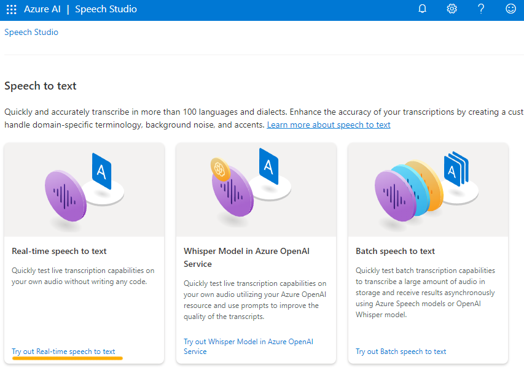

---
lab:
  title: Explorar o Speech Studio
---

# Explorar o Speech Studio

O serviço de **Fala de IA do Azure** transcreve fala em texto, e texto em fala audível. Você pode usar a Fala de IA para criar um aplicativo capaz de transcrever anotações de reunião ou gerar texto a partir da gravação de entrevistas.

Neste exercício, você experimentará os recursos da Fala de IA do Azure usando o Speech Studio da IA do Azure. 

## Criar um recurso de *Fala de IA do Azure*

O serviço de Fala pode ser usado por meio da criação de um recurso de **Fala** ou dos **serviços de IA do Azure**.

Neste exercício, você criará um recurso de Fala de IA, a menos que já tenha um recurso que possa usar.

1. Em outra guia do navegador, abra o [Speech Studio da IA do Azure](https://speech.microsoft.com/) e entre com sua conta Microsoft.

1. Selecione **Configurações** e, em seguida, **Criar um recurso**. Defina-o com as seguintes configurações:
    - **Nome do novo recurso**: *Insira um nome exclusivo*.
    - **Assinatura**: *sua assinatura do Azure*.
    - **Região**: *Selecione uma [região com suporte](https://learn.microsoft.com/azure/ai-services/speech-service/regions)*.
    - **Tipo de preço**: *FO Gratuito (se disponível, caso contrário, selecione Standard S0).*
    - **Grupo de recursos**: *selecione ou crie um grupo de recursos com um nome exclusivo*.
1. Selecione **Criar recurso**. Aguarde até que o recurso tenha sido criado e selecione **Usar recurso**. A página Introdução à Fala é exibida.

## Explorar a conversão de fala em texto no Speech Studio

1. Selecione [**https://aka.ms/mslearn-speech-files**](https://aka.ms/mslearn-speech-files) para baixar **speech.zip**. Abra a pasta . 

1. Na página Introdução à Fala, em *Fala*, encontre *Conversão de fala em texto em tempo real*. Selecione **Experimente a conversão de fala em texto em tempo real**.

    

1. Em *Escolher arquivos de áudio*, selecione **Procurar arquivos** e navegue até a pasta em que você salvou o arquivo. Selecione **WhatAICanDo.m4a** e **Abrir**.

    

1. O serviço de Fala transcreve e exibe o texto em tempo real. Se você tiver áudio no computador, poderá ouvir a gravação enquanto o texto estiver sendo transcrito.
1. Examine a saída, que deve ter reconhecido o áudio e o transcrito com êxito em texto.

    > **Observação**: se você receber uma mensagem de erro, aguarde alguns minutos antes de tentar novamente. Leva um pouco de tempo para que o recurso de Fala esteja disponível para o primeiro uso.

Neste exercício, você criou um recurso de Fala de IA no Speech Studio. Em seguida, você usou o serviço de Conversão de fala em texto em tempo real para transcrever uma gravação de áudio. Você pôde ver a transcrição de texto sendo gerada à medida que o arquivo de áudio era reproduzido.

## Limpeza

Se você não pretende fazer mais exercícios, exclua todos os recursos que você não precisa mais. Isso evita o acúmulo de custos desnecessários.

1. Abra o [portal do Azure]( https://portal.azure.com) e selecione o grupo de recursos que contém o recurso que você criou.
1. Selecione o recurso e selecione **Excluir** e, em seguida, **Sim** para confirmar. Em seguida, o recurso é excluído.

## Saiba mais

Este exercício demonstrou apenas algumas das funcionalidades do serviço de Fala. Saiba mais sobre o que você pode fazer com esse serviço consultando a [página de Fala](https://azure.microsoft.com/services/cognitive-services/speech-services).
