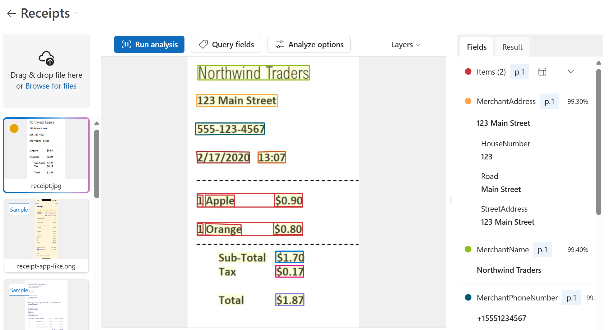

---
lab:
  title: Extrair dados de documentos no portal da Fábrica de IA do Azure
---

# Extrair dados de documentos no portal da Fábrica de IA do Azure

O serviço **IA do Azure para Informação de Documentos** permite que você analise e extraia informações de formulários e documentos e, em seguida, identifique nomes de campos e dados. 

Como a Informação de Documentos se baseia no reconhecimento óptico de caracteres (OCR)? Embora o OCR possa ler documentos impressos ou manuscritos, ele extrai o texto em um formato não estruturado que é difícil de armazenar em um banco de dados ou analisar. A Informação de Documentos dá sentido aos dados não estruturados ao capturar a estrutura do texto, como campos de dados e informações em tabelas. 

Neste exercício, você usará os modelos predefinidos da IA do Azure para Informação de Documentos no portal da Fábrica de IA do Azure, a plataforma da Microsoft para criar aplicativos inteligentes, para reconhecer dados de um recibo. 

## Criar um projeto no portal do Foundry da IA do Azure

Vamos começar criando um projeto da Fábrica de IA do Azure.

1. Em um navegador da Web, abra o [Portal da Fábrica de IA do Azure](https://ai.azure.com) em `https://ai.azure.com` e entre usando suas credenciais do Azure. Feche todas as dicas ou painéis de início rápido abertos na primeira vez que você entrar e, se necessário, use o logotipo da **Fábrica de IA do Azure** no canto superior esquerdo para navegar até a home page, que é semelhante à imagem a seguir (feche o painel **Ajuda** se estiver aberto):

    

1. Na home page, clique em **+ Criar um agente**.

1. No assistente **Criar um agente**, insira um nome válido para o projeto. 

1. Clique em **Opções avançadas** e especifique as seguintes configurações:
    - **Recurso da Fábrica de IA do Azure**: *manter o nome padrão*
    - **Assinatura**: *sua assinatura do Azure*
    - **Grupo de recursos**: *criar ou selecionar um grupo de recursos*
    - **Região**: selecione um dos seguintes locais:
        * Leste dos EUA
        * França Central
        * Coreia Central
        * Europa Ocidental
        * Oeste dos EUA

1. Clique em **Criar** e revise a configuração. Aguarde a conclusão do processo de configuração.

    >**Observação**: se você receber um erro de permissões, clique no botão **Corrigir** para adicionar as permissões apropriadas para continuar.

1. Quando o projeto for criado, o playground Agentes abrirá por padrão no portal da Portal da Fábrica de IA do Azur, que será semelhante à imagem a seguir:

    

1. Em uma nova janela do navegador, abra a [página de exploração de Serviços de IA do Azure](https://ai.azure.com/explore/aiservices).

1. Na página *Serviços de IA*, clique no bloco *Visão + Documento* para experimentar os recursos Visão de IA do Azure e Documento.

## Analisar um recibo com a IA do Azure para Informação de Documentos na Fábrica de IA do Azure 

Agora você está pronto para analisar um recibo da empresa fictícia de varejo Northwind Traders.

1. Na página *Visão + Documento*, role para baixo e selecione **Documento**. Em *Modelos predefinidos para documentos específicos*, selecione o bloco **Recibos**.

1. Na lista suspensa em *Experimentar*, observe que o recurso de serviços de IA do Azure está selecionado. Deixe-o como está.

1. No computador, use [**https://aka.ms/mslearn-receipt**](https://aka.ms/mslearn-receipt) para abrir uma imagem de amostra de um recibo. Salve-a na Área de Trabalho ou na pasta Downloads. 
 
1. Na Fábrica de IA do Azure, na página *Recibos*, selecione **Procurar arquivos** e navegue até a pasta onde você salvou a imagem. Selecione a imagem do recibo e, em seguida, **Abrir**. A imagem aparece no lado esquerdo da tela.

    

1. À direita, selecione **Executar análise**.

1. Quando a análise for executada, os resultados serão retornados. Observe que o serviço reconheceu campos de dados específicos, como o nome do comerciante, o endereço, o número de telefone e a data e hora da transação, bem como os itens de linha, o subtotal, o imposto e o valor total. Ao lado de cada campo há uma probabilidade percentual de que o campo esteja correto.

    

Neste exercício, você usou o modelo predefinido de recibos da IA do Azure para Informação de Documentos no portal da Fábrica de IA do Azure. A partir dos resultados retornados, você viu como a Informação de Documentos foi capaz de identificar campos específicos, permitindo que os dados de documentos diários fossem processados com mais facilidade. Antes de fechar a demonstração, por que não experimentar alguns dos recibos de amostra, incluindo aqueles em idiomas diferentes?

## Limpeza

Se você não pretende fazer mais exercícios, exclua todos os recursos de que não precisa mais. Isso evita o acúmulo de custos desnecessários.

1. Abra o [portal do Microsoft Azure]( https://portal.azure.com) e selecione o grupo de recursos que contém o recurso que você criou.
1. Selecione o recurso e selecione **Excluir** e, em seguida, **Sim** para confirmar. Em seguida, o recurso é excluído.

## Saiba mais

Esse exercício demonstrou apenas algumas das funcionalidades do serviço IA para Informação de Documentos. Para saber mais sobre o que você pode fazer com esse serviço, confira a página [Informação de Documentos](https://learn.microsoft.com/azure/ai-services/document-intelligence/overview?view=doc-intel-3.1.0).
