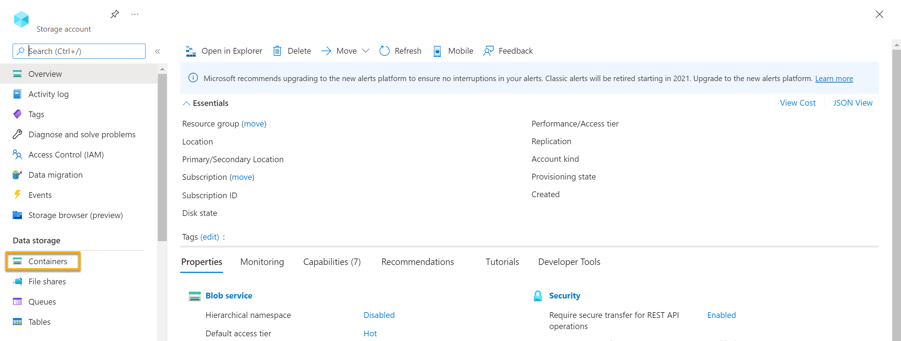

---
lab:
  title: Explorar um índice da Pesquisa de IA do Azure (interface do usuário)
---

# Explorar um índice da Pesquisa de IA do Azure (interface do usuário)

Vamos imaginar que você trabalhe para a Fourth Coffee, uma rede nacional de cafés. Você ficou encarregado de ajudar a criar uma solução de mineração de conhecimento que facilita a pesquisa de insights sobre as experiências dos clientes. Decida criar um índice de Pesquisa de IA do Azure usando os dados extraídos de revisões de clientes.  

Neste laboratório, você vai:

- Criar recursos do Azure
- Extrair dados de uma fonte de dados
- Enriquecer os dados com habilidades de IA
- Usar o indexador do Azure no portal do Azure
- Consultar o índice de pesquisa
- Examinar os resultados salvos em um Repositório de Conhecimento

## Recursos do Azure necessários

A solução que você criará para a Fourth Coffee exige os seguintes recursos na sua assinatura do Azure:

- Um recurso do da **Pesquisa de IA do Azure**, que gerenciará a indexação e a consulta.
- Um recurso dos **serviços de IA do Azure**, que fornece serviços de IA para habilidades que a sua solução de pesquisa pode usar para enriquecer os dados na fonte de dados com insights gerados pela IA.

    > **Observação**: seus recursos da Pesquisa de IA do Azure e dos serviços de IA do Azure devem estar no mesmo local!

- Uma **Conta de armazenamento** com contêineres de blob, que armazena documentos brutos e outras coleções de tabelas, objetos ou arquivos.

### Criar um recurso de *Pesquisa de IA do Azure*

1. Faça logon no [Portal do Azure](https://portal.azure.com/learn.docs.microsoft.com?azure-portal=true).

1. Clique no botão **+ Criar um recurso**, pesquise por *Pesquisa de IA do Azure* e crie um recurso de **Pesquisa de IA do Azure** com as seguintes configurações:

    - **Assinatura**: *sua assinatura do Azure*.
    - **Grupo de recursos**: *selecione ou crie um grupo de recursos com um nome exclusivo*.
    - **Nome do serviço**: *um nome exclusivo*.
    - **Localização**: *Escolha qualquer região disponível. Se estiver no leste dos EUA, use "Leste dos EUA 2"*.
    - **Tipo de preço**: Básico

1. Selecione **Examinar + criar**, após a exibição da mensagem **Validação Bem-sucedida** e selecione **Criar**.

1. Após a implantação ser concluída, selecione **Ir para o recurso**. Na página de visão geral da Pesquisa de IA do Azure, você pode adicionar índices, importar dados e pesquisar os índices criados.

### Criar um recurso dos serviços de IA do Azure

Você precisará provisionar um recurso **serviços de IA do Azure** que esteja no mesmo local que seu recursa Pesquisa de IA do Azure. Sua solução de pesquisa usará esse recurso para enriquecer os dados no armazenamento de dados com insights gerados pela IA.

1. Retorne à página inicial do portal do Azure. Clique no botão **&#65291;Criar um recurso** e pesquise por *serviços de IA do Azure*. Selecione **criar** um plano dos **serviços de IA do Azure**. Você será levado para uma página para criar um recurso dos serviços de IA do Azure. Defina-o com as seguintes configurações:
    - **Assinatura**: *sua assinatura do Azure*.
    - **Grupo de recursos**: *O mesmo grupo de recursos que o seu recurso da Pesquisa de IA do Azure*.
    - **Região**: *O mesmo local do seu recurso da Pesquisa de IA do Azure*.
    - **Nome**: *um nome exclusivo*.
    - **Tipo de preço**: Standard S0
    - **Ao marcar esta caixa, confirmo que li e compreendi todos os termos abaixo**: selecionada

1. Selecione **Examinar + criar**. Depois de ver a resposta **Validação aprovada**, selecione **Criar**.

1. Aguarde a conclusão da implantação e veja os detalhes da implantação.

### Criar uma conta de armazenamento

1. Retorne à página inicial do portal do Azure e selecione o botão **+ Criar um recurso**.

1. Pesquise *conta de armazenamento* e crie um **Armazenamento de conta** com as seguintes configurações:
    - **Assinatura**: *sua assinatura do Azure*.
    - **Grupo de recursos**: *O mesmo grupo de recursos que seus recursos da Pesquisa de IA do Azure e dos serviços de IA do Azure*.
    - **Nome da conta de armazenamento**: *um nome exclusivo*.
    - **Localização**: *escolha uma localização disponível*.
    - **Desempenho**: padrão
    - **Redundância**: LRS (armazenamento com redundância local)

1. Clique em **Examinar e criar** e depois clique em **Criar**. Aguarde a conclusão da implantação e acesse o recurso implantado.

1. Na conta de Armazenamento do Microsoft Azure que você criou, no painel de menu à esquerda, selecione **Configuração** (em **Configurações**).
1. Altere a configuração de *Permitir acesso anônimo ao Blob* para **Habilitado** e, em seguida, selecione **Salvar**.

## Carregar documentos no Armazenamento do Azure

1. No painel de menu à esquerda, selecione **Contêineres**.

    

1. Selecionar **+ Contêiner**. Um painel no lado direito será exibido.

1. Insira as seguintes configurações e clique em **Criar**:
    - **Nome**: coffee-reviews  
    - **Nível de acesso público**: contêiner (acesso de leitura anônimo para contêineres e blobs)
    - **Avançado**: *sem alterações*.

1. Em uma nova guia do navegador, faça o download das [revisões de café compactadas](https://aka.ms/mslearn-coffee-reviews) de `https://aka.ms/mslearn-coffee-reviews` e extraia os arquivos para a pasta *revisões*.

1. No portal do Azure, selecione o contêiner *coffee-reviews*. No contêiner, selecione **Carregar**.

    

1. No painel **Carregar blob**, clique em **Selecionar um arquivo**.

1. Na janela do Explorer, selecione **todos** os arquivos na pasta *Revisões*, selecione **Abrir** e, em seguida, selecione **Carregar**.

    

1. Quando o carregamento for concluído, você poderá fechar o painel **Carregar blob**. Seus documentos estão agora no seu contêiner de armazenamento *coffee-reviews*.

## Indexar os documentos

Depois de ter os documentos armazenados, você pode usar a Pesquisa de IA do Azure para extrair insights dos documentos. O portal do Azure fornece um *assistente de importação de dados*. Com esse assistente, você pode criar automaticamente um índice e um indexador para as fontes de dados com suporte. Você usará o assistente para criar um índice e importar seus documentos de pesquisa do armazenamento para o índice da Pesquisa de IA do Azure.

1. No portal do Azure, procure pelo seu recurso da Pesquisa de IA do Azure. Na página **Visão geral**, selecione **Importar dados**.

    

1. Na página **Conectar-se aos seus dados**, na lista **Fonte de Dados**, escolha **Armazenamento de Blobs do Azure**. Preencha os detalhes do armazenamento de dados com os seguintes valores:
    - **Fonte de dados**: Armazenamento de Blobs do Azure
    - **Nome da fonte de dados**: coffee-customer-data
    - **Dados para extração**: Conteúdo e metadados
    - **Modo de análise**: Padrão
    - **Cadeia de conexão**: *selecione **Escolher uma conexão existente**. Selecione sua conta de armazenamento, selecione o contêiner de **coffee-reviews** e clique em **Selecionar**.
    - **Autenticação da identidade gerenciada**: Nenhuma
    - **Nome do contêiner**: *essa configuração é preenchida automaticamente depois que você escolhe uma conexão existente*.
    - **Pasta do blob**: *deixe essa opção em branco*.
    - **Descrição**: Avaliações da rede de cafés Fourth Coffee.

1. Selecione **Avançar: adicionar habilidades cognitivas (opcional)**.

1. Na seção **Anexar Serviços Cognitivos**, selecione o recurso de serviços de IA do Azure.  

1. Na seção **Adicionar enriquecimentos**:
    - Altere o **Nome do conjunto de habilidades** para **coffee-skillset**.
    - Marque a caixa de seleção **Habilitar OCR e mesclar todo o texto no campo merged_content**.
        > **Observação** É importante escolher **Habilitar OCR** para ver todas as opções de campos enriquecidos.
    - Verifique se o **campo Dados de origem** está definido **como merged_content**.
    - Altere o **Nível de granularidade de enriquecimento** para **Páginas (partes de 5.000 caracteres)**.
    - Não selecione *Habilitar enriquecimento incremental*
    - Selecione os seguintes campos enriquecidos:

        | Habilidade cognitiva | Parâmetro | Nome do campo |
        | --------------- | ---------- | ---------- |
        | Extrair nomes de localização | | Locais |
        | Extrair frases-chave | | keyphrases |
        | Detectar sentimento | | sentimento |
        | Gerar marcas com base em imagens | | imageTags |
        | Gerar legendas com base em imagens | | imageCaption |

1. Em **Salvar enriquecimentos em um repositório de conhecimento**, selecione:
    - Projeções de imagem
    - Documentos
    - Pages (Páginas)
    - Frases principais
    - Entities
    - Detalhes da imagem
    - Referências de imagem

    > **Observação** Se um aviso solicitando uma **Cadeia de conexão da conta de armazenamento** aparecer.
    >
    > 
    >
    > 1. Selecione **Escolher uma conexão existente**. Selecione a conta de armazenamento criada anteriormente.
    > 1. Clique em **+ Contêiner** para criar um contêiner chamado **knowledge-store** com o nível de privacidade definido como **Privado** e selecione **Criar**.
    > 1. Selecione o contêiner **knowledge-store** e clique em **Selecionar** na parte inferior da tela.

1. Selecione **projeções de blob do Azure: Documento**. Será exibida uma configuração do *Nome do contêiner* com o contêiner *knowledge-store* preenchido automaticamente. Não altere o nome do contêiner.

1. Selecione **Avançar: Personalizar índice de destino**. Altere o **Nome do índice** para **coffee-index**.

1. Verifique se a **Chave** está configurada como **metadata_storage_path**. Deixe **Nome do sugestor** em branco e **Modo de pesquisa** preenchido automaticamente.

1. Examine as configurações padrão dos campos de índice. Selecione **filtrável** em todos os campos que já estão selecionados por padrão.

    

1. Selecione **Próximo: Criar um indexador**.

1. Altere o **Nome do indexador** para **coffee-indexer**.

1. Mantenha o **Agendamento** definido como **Uma vez**.

1. Expanda as **Opções avançadas**. Verifique se a opção **Chaves de codificação de Base 64** está selecionada, pois as chaves de codificação podem tornar o índice mais eficiente.

1. Escolha **Enviar** para criar a fonte de dados, o conjunto de habilidades, o índice e o indexador. O indexador é executado automaticamente e executa o pipeline de indexação, que:
    - Extrai os campos de metadados do documento e o conteúdo da fonte de dados.
    - Executa o conjunto de habilidades cognitivas para gerar mais campos enriquecidos.
    - Mapeia os campos extraídos para o índice.

1. Retorne à página de recursos da Pesquisa de IA do Azure. No painel esquerdo, em **Gerenciamento de Pesquisa**, selecione  **Indexadores**. Essa guia mostra o **indexador de café** recém-criado. Aguarde um minuto e selecione **&orarr;Atualizar** até que o **Status** indique êxito.

1. Selecione o nome do indexador para ver mais detalhes.

    

## Consulte o índice

Use o Gerenciador de pesquisa para escrever e testar as consultas. O Gerenciador de pesquisa é uma ferramenta criada no portal do Azure que oferece uma maneira fácil de validar a qualidade de seu índice de pesquisa. Use o Gerenciador de pesquisa para escrever consultas e revisar os resultados em JSON.

1. Na página *Visão geral* do serviço Pesquisa, selecione **Gerenciador de pesquisa** na parte superior da tela.

   

2. Observe como o índice selecionado é o *coffee-indexer* que você criou. Abaixo do índice selecionado, altere a *exibição* para o **modo de exibição JSON**. 

    

No campo **editor de consultas JSON**, copie e cole: 
```json
{
    "search": "*",
    "count": true
}
```
3. Selecione **Pesquisar**. A consulta de pesquisa retorna todos os documentos no índice de pesquisa, incluindo uma contagem de todos os documentos no campo **@odata.count**. O índice de pesquisa deve retornar um documento JSON contendo os resultados da pesquisa.

4. Agora, vamos filtrar por localização. No campo **editor de consultas JSON**, copie e cole: 
```json
{
    "search": "locations:'Chicago'",
    "count": true
}
```
5. Selecione **Pesquisar**. A consulta pesquisa todos os documentos no índice e filtra as análises com uma localização de Chicago. Você deve ver `3` no campo `@odata.count`.

6. Agora, vamos filtrar por sentimento. No campo **editor de consultas JSON**, copie e cole: 
```json
{
    "search": "sentiment:'negative'",
    "count": true
}
```
7. Selecione **Pesquisar**. A consulta pesquisa todos os documentos no índice e filtra as análises com um sentimento negativo. Você deve ver `1` no campo `@odata.count`.

   > **Observação** Veja como os resultados são classificados por `@search.score`. Essa é a pontuação atribuída pelo mecanismo de pesquisa para mostrar o quanto os resultados correspondem à consulta fornecida.

8. Um dos problemas que queremos resolver é o motivo pelo qual pode haver determinadas avaliações. Vamos dar uma olhada nas frases-chave associadas à avaliação negativa. Qual você acha que pode ser a causa da avaliação?

## Revisar o repositório de conhecimento

Por fim, vejamos o poder do repositório de conhecimento em ação. Quando você executou o *Assistente de importação de dados*, também criou um repositório de conhecimento. No repositório de conhecimento, você verá que os dados enriquecidos extraídos por habilidades de IA persistem na forma de projeções e tabelas.

1. No portal do Azure, navegue de volta para a conta de armazenamento do Azure.

2. No painel de menu à esquerda, selecione **Contêineres**. Selecione o contêiner **knowledge-store**.

    

3. Selecione qualquer um dos itens e clique no arquivo **objectprojection.json**.

    

4. Selecione **Editar** para ver o JSON produzido por um dos documentos do seu armazenamento de dados do Azure.

    

5. Selecione a trilha do blob de armazenamento no canto superior esquerdo da tela para retornar aos *Contêineres* da conta de armazenamento.

    

6. Em *Contêineres*, selecione o contêiner *coffee-skillset-image-projection*. Selecione um dos itens.

    

7. Selecione qualquer um dos arquivos *.jpg*. Selecione **Editar** para ver a imagem armazenada do documento. Observe como todas as imagens dos documentos são armazenadas dessa maneira.

    

8. Selecione a trilha do blob de armazenamento no canto superior esquerdo da tela para retornar aos *Contêineres* da conta de armazenamento.

9. Selecione **Navegador de armazenamento** no painel à esquerda e escolha **Tabelas**. Há uma tabela para cada entidade no índice. Selecione a tabela *coffeeSkillsetKeyPhrases*.

    Confira as frases-chave que o repositório de conhecimento conseguiu capturar do conteúdo nas avaliações. Muitos dos campos são chaves, então é possível vincular as tabelas como um banco de dados relacional. O último campo mostra as frases-chave que foram extraídas pelo conjunto de habilidades.

## Saiba mais

Esse índice de pesquisa simples apresenta apenas algumas das funcionalidades do serviço Pesquisa de IA do Azure. Para saber mais sobre o que você pode fazer com esse serviço, confira a página do serviço [Pesquisa de IA do Azure](https://learn.microsoft.com/azure/search).
