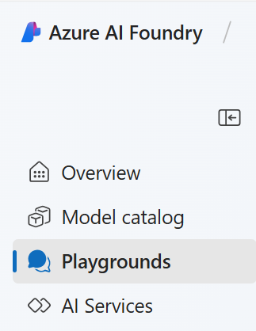

---
lab:
  title: Explorar a IA generativa no Portal da Fábrica de IA do Azure
---

# Explorar a IA generativa no Portal da Fábrica de IA do Azure

A IA generativa descreve uma categoria de recursos dentro da IA que criam conteúdos. As pessoas normalmente interagem com a IA generativa que foi incorporada a aplicativos de chat. Neste exercício, você experimentará a IA generativa no portal da Fábrica de IA do Azure, a plataforma da Microsoft para criar aplicativos inteligentes. 

## Criar um projeto no portal do Foundry da IA do Azure

1. Em uma guia do navegador, navegue até a [Fábrica de IA do Azure](https://ai.azure.com?azure-portal=true).

1. Entre com sua conta. 

1. Na home page do portal da Fábrica de IA do Azure, selecione **Criar um projeto**. Na Fábrica de IA do Azure, os projetos são contêineres que ajudam a organizar o trabalho.  

    

1. No painel *Criar um projeto*, você verá um nome de projeto gerado, que pode ser mantido como está. Caso tenha criado um hub no passado, você verá uma lista de *novos* recursos do Azure a serem criados ou uma lista suspensa de hubs existentes. Se você vir a lista suspensa de hubs existentes, selecione *Criar novo hub*, crie um nome exclusivo para seu hub e selecione *Avançar*.  
 
    

> **Importante**: você precisará de um recurso de serviços de IA do Azure provisionado em um local específico para concluir o restante do laboratório.

1. No mesmo painel *Criar um projeto*, selecione **Personalizar** e selecione um dos seguintes **locais**: Leste dos EUA, França Central, Coreia Central, Oeste da Europa ou Oeste dos EUA para concluir o restante do laboratório. Em seguida, selecione **Criar**. 

1. Anote os recursos criados: 
- Serviços de IA do Azure
- Hub de IA do Azure
- Projeto de IA do Azure
- Conta de armazenamento
- Key vault
- Grupo de recursos  
 
1. Depois que os recursos forem criados, a página *Visão geral* do projeto abrirá. No menu à esquerda da tela, selecione **Playgrounds**.
 
      

## Explorar a IA generativa no playground de chat da Fábrica de IA do Azure

1. Na página Playgrounds da Fábrica de IA do Azure, selecione **Experimentar o Playground Chat**. O playground chat é uma interface de usuário que permite que você crie um aplicativo de chat com diferentes modelos de IA generativa.  

1. Para usar o Playground Chat, você precisa associá-lo a um modelo implantado. No Playground chat, selecione **Criar uma implantação**. Pesquise e selecione **gpt-4**. 

1. Na janela *Implantar modelo*, mantenha a nomenclatura e a seleção padrão e selecione **Implantar**. Pode levar um instante para que o modelo seja implantado. Você pode verificar o status da implantação selecionando *Modelos e pontos de extremidade* no menu à esquerda em *Meus ativos*.
1. No playground chat, você pode usar o modelo implantado quando ele aparecer no menu de seleção *Implantação*. Verifique se o modelo implantado está selecionado. É importante ressaltar que você precisa selecionar **Aplicar alterações** depois de fazer alterações na *Configuração*. 

1. Considere as seguintes maneiras de melhorar as respostas de um assistente de IA generativa:
    - Comece com uma meta específica para o que deseja que o assitente faça
    - Itere com base em prompts e respostas anteriores para refinar o resultado
    - Forneça uma fonte para basear a resposta em um escopo específico de informações
    - Adicione contexto para maximizar a adequação e a relevância da resposta
    - Defina expectativas claras para a resposta

1. Vamos tentar gerar uma ressonância usando um prompt com um objetivo específico. Na caixa de chat, insira o seguinte prompt:

    ```prompt
    I'm planning a trip to Paris in September. Can you help me?
    ```

1. Revise a resposta. **Observação**: tenha em mente que a resposta específica recebida pode variar devido à natureza da IA generativa.
 
1. Vamos tentar outro prompt. Insira o seguinte:

    ```prompt
    Where's a good location in Paris to stay? 
    ```

1. Revise a resposta, que fornecerá alguns lugares para ficar em Paris.

1. Vamos iterar com base em prompts e respostas anteriores para refinar o resultado Digite o seguinte prompt:
    
    ```prompt
    Can you give me more information about dining options near the first location?
    ``` 

1. Revise a resposta, que fornecerá opções de alimentação perto de um local da resposta anterior. 

1. Agora, vamos fornecer uma fonte para basear a resposta em um escopo específico de informações. Insira o seguinte: 
    
    ```prompt
    Based on the information at https://en.wikipedia.org/wiki/History_of_Paris, what were the key events in the city's history?
    ```

1. Revise a resposta, que fornecerá informações com base no site fornecido. 

1. Vamos tentar adicionar contexto para maximizar a relevância da resposta. Digite o seguinte prompt: 

    ```prompt
    What three places do you recommend I stay in Paris to be within walking distance to historical attractions? Explain your reasoning.
    ```

1. Revise a resposta e a argumentação da resposta.  

1. Agora, tente definir expectativas claras para a resposta. Digite o seguinte prompt:
    
    ```prompt
    What are the top 10 sights to see in Paris? Answer with a numbered list in order of popularity.
    ```

1. Revise a resposta, que fornecerá uma lista numerada de pontos turísticos para ver em Paris.

1. Quando terminar, você pode fechar a janela do navegador.